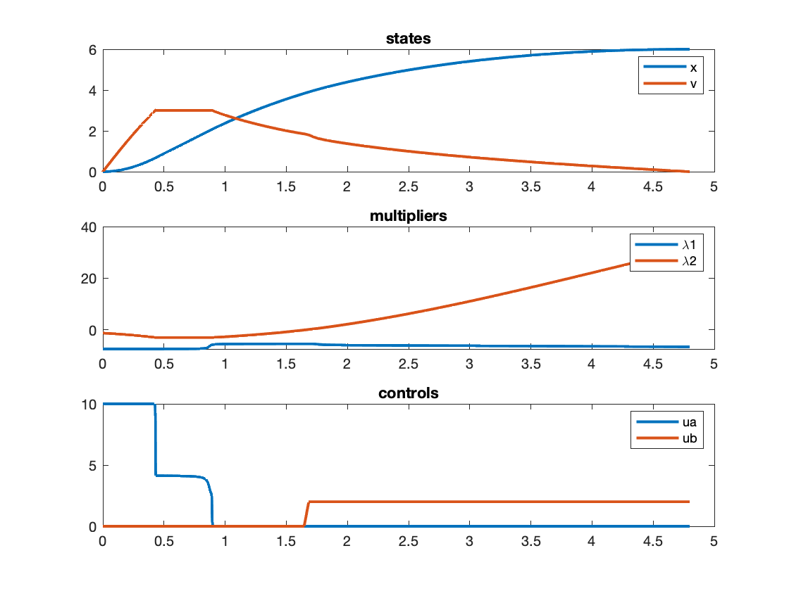

:stem: latexmath

Train model with two controls
==============================

Authors
-------
_Enrico Bertolazzi and Francesco Biral_

The dynamical system with states stem:[x(\zeta)], stem:[v(\zeta)]
controls stem:[u_a(\zeta)] and stem:[u_b(\zeta)] and
stem:[\zeta\in[0,3.8]]

[latexmath]
++++
\newcommand{\seteqsize}{\normalsize}
\seteqsize
\begin{eqnarray}
  x'(\zeta) & = & v(\zeta) \\
  v'(\zeta) & = & a(x(\zeta),v(\zeta))+u_a(\zeta)-u_b(\zeta)
\end{eqnarray}
++++

where

[latexmath]
++++
\seteqsize
\begin{eqnarray}
  a(x,v) &=& h(x)-(\alpha+\beta v+\gamma v^2)\\
  h(x)   &=& \frac{1}{\pi}\sum_{j=1}^3 (s_{j+1}-s_j)
  \arctan\frac{x-z_j}{\epsilon}
\end{eqnarray}
++++

and

[latexmath]
++++
\seteqsize
\begin{array}{rclrclrcl}
  \epsilon &=& 0.05,\qquad &
  \mathbf{s} &=& \pmatrix{ -2, 0, 2 }\qquad&
  \mathbf{z} &=& \pmatrix{ 2, 4 }\\
  \alpha &=& 0.3,\qquad&
  \beta  &=& 0.14,\qquad&
  \gamma &=& 0.16,
\end{array}
++++

The controls are bounded by

[latexmath]
++++
\seteqsize
  0 \leq u_a(\zeta) \leq 10,\qquad
  0 \leq u_b(\zeta) \leq 2,
++++

Boudary conditions

[latexmath]
++++
\seteqsize
x(0)   = 0,\qquad
x(3.8) = 6,\qquad
v(0)=v(3.8) = 0,
++++

Results
-------

